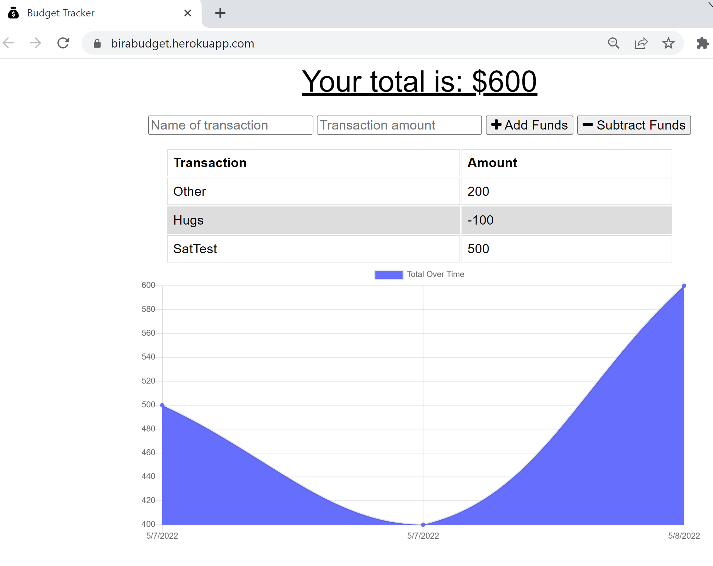

# Birabudget-tracker
A Progressive Web Application with offline capabilities

## Project Description
An update to a budget tracker application that will allow users offline access and functionality, so that users can have access to budgeting information at any time. The user will be able to add expenses and deposits to their budget with or without a connection. 

## User Story
```
AS an avid traveler
I want to be able to track my withdrawals and deposits with or without a data/internet connection
SO that my account balance is accurate when I am traveling
```

## Technologies
* CSS
* HTML
* JavaScript
* MongoDB
* MongoDB Atlas
* Heroku deployment
* Web manifest 

## Link to Deployed page
https://birabudget.herokuapp.com/

## Screenshot


## License [](https://opensource.org/licenses/MIT)